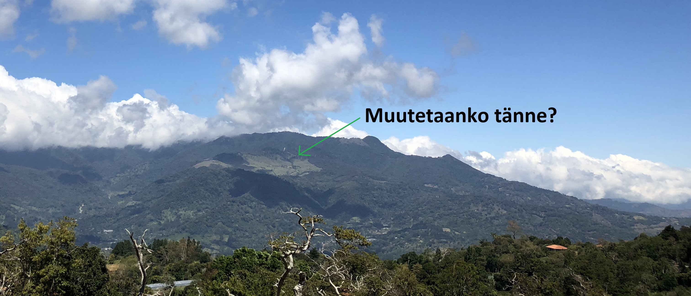

# Pitkonäärit-yhteisö ja resurssien jakaminen

## Esittely
Pitkonäärin Paratiisi -sivusto on tehty tiedon jakamiseen. Tänne Boqueteen saapuvien ihmisten kesken voimme kuitenkin jakaa enemmänkin kuin vain tietoa: voimme esimerkiksi hoitaa keskitetyillä resursseilla kaikenlaiset maahanmuuttokuviot, ilman että jokaisen tarvitsee keksiä pyörää uudelleen.

Voimme auttaa toisiamme kaikenlaisissa asioissa jotka yksin tehtynä paisuvat helposti päivien operaatioiksi, jotka voisivat hoitua vartissa kunhan vain joku tietää etukäteen miten hommat kuuluu hoitaa. Ajan ja hermojen säästäminen onkin ensimmäinen asia minkä voimme yhteistyöllä saavuttaa.

Yhteisellä koordinoinnilla voimme kuitenkin saavuttaa enemmänkin ja voimme jakaa myös konkreettisia resursseja. Paikkariippumattomilla henkilöillä ei esimerkiksi liene tarvetta auton päivittäiseen käyttöön, mutta toisaalta kokonaan ilman autoa täällä on vähän hankala olla.

Vastaavia asioita on paljon: yksittäisinä hankintoina kalliita asioita, joita tarvitaan satunnaisesti. Jakamalla näitä resursseja voimme saada niistä täyden hyödyn murto-osalla hinnasta. Samalla niiden hankintaan ja ylläpitoon liittyvä turha häsläys tippuu murto-osaan.

### Yhteisö? Jaetut resurssit? Oletteko jotain kommunisteja tai lahkolaisia?

Väärinkäsitysten välttämiseksi lienee paikallaan selventää, että minkäänlaista _sosialistista kommuunia tänne ei todellakaan olla rakentamassa_. Lähtökohta on se, että jokainen huolehtii itse itsestään, emmekä  tähtää minkäänlaisiin kokeellisiin utopioihin. Pyrimme hyödyntämään jakamistalouden hyviä puolia kapitalistisista lähtökohdista ([toimivaksi todistetuilla periaatteilla](https://www.youtube.com/watch?v=qFIjWVCUBHk)), ja jokainen voi täysin vapaasti valita oman osallistumisasteensa. Jos tuntuu siltä että haluat vaikka omistaa kokonaan oman auton tai asua vapaasti valitsemassasi paikassa, niin se ei ole muilta millään tavalla pois. **Elämme omilla, emme toistemme rahoilla.** Tämän sivun tarkoitus on vain ja ainoastaan herätellä ideoita siitä, minkälaisia _lisähyötyjä_ yhdessä toimimalla voi saavuttaa.

## Asuinalue
Toistaiseksi teoreettinen, mutta pitkällä tähtäimellä suurin hyöty voisi olla yhteisen asuinalueen perustaminen. Boquete on maaseutua, ja kunnallistekniikka voi täällä välillä jättää toivomisen varaa.

Sähkökatkoja on usein ja sijainnista riippuen myös vesikatkoja voi olla. Näihin on tietenkin omat paikalliset ratkaisunsa (UPS:t, vesitankit yms), mutta yksittäin hankittuna ne ovat kalliimpia ja aiheuttavat ylimääräistä säätöä.

Jos kiinnostuneita olisi riittävästi, niin voisimme ostaa jostakin vuorten siimeksestä isomman tontin ja rakentaa sinne kunnon talot ja toimivan "kunnallistekniikan".

Sähkökatkoilla ei olisi väliä, jos meillä olisi oma aurinkosähköfarmi. Auringostahan Boquetessa ei ole pulaa ja useamman talouden yhdistämällä saisimme kaikenlaisia volyymietuja.

Myös "luksusosaston" hankinnat ja järjestelyt onnistuisivat lähekkäin asuessa huomattavasti paremmin. Voisimme myös palkata täysipäiväistä henkilökuntaa (siivoojat, kokit, autokuskit, puutarhurit yms) hyvin kohtuullisilla kustannuksilla.

Yksi lisähyöty yhteisestä asuinalueesta on myös suurempi paikkariippumattomuus: talosi vuokraaminen eteenpäin vaikkapa puoleksi vuodeksi helpottuu huomattavasti, kun naapurit voivat auttaa vuokralaisen kanssa ja pitää taloa silmällä. **Voit siis matkustella vapaasti JA pitää pysyvän asunnon.**

Boquetessa ei ole elokuvateatteria, joten kaikilla herkuilla varustettu riittävän iso kotiteatteri olisi hyvä idea.

_Kuvassa näkyvä tontti ei ehkä ole myynnissä, mutta jotain vastaavankaltaista täältä voi varmasti löytää._

### Täsmennyksiä mahdollisiin väärinkäsityksiin joita ajatus yhteisestä asuinalueesta voi joissakin aiheuttaa

Ideana ei ole asua kylki kyljessä laulamassa Kumbayaa. Ajatuksenamme on löytää riittävän iso tontti, että naapurin normaali (tai epänormaali) elämä ei pääse häiritsemään. **Yllä olevassa kuvassa näkyvä esimerkkialue on neliökilometrin kokoinen.** Jos siellä olisi 10 taloa, niin matkaa naapuriin olisi keskimäärin n. 300 metriä. Tiiviimminkin voi asua jos siltä tuntuu, kaikkihan on täysin sovittavissa. Pyrimme myöskin mahdollisimman vähäisiin yhteisiin velvoitteisiin, päätavoite on kustannusten jakaminen ja palveluiden helpompi järjestäminen, ei minkään lahkon perustaminen.

## Laskelmia

Olemme listanneet tähän muutamia _laskennallisia_ esimerkkejä/ideoita helposti jaettavista hankinnoista. Pienempiäkin (alle 1000e arvoisia) resursseja voi tietysti jakaa, mutta niitä lienee turha listata tänne erikseen. Jokainen vastaa kuitenkin ensisijaisesti itsestään/perheestään, koska emme ole sosialistien paratiisi. Näiden mahdollisesti hankittavien resurssien jakaminen ei myöskään riipu millään tavalla yllä mainitusta asuinalueesta: yhteishankintoihin voit osallistua tai olla osallistumatta, riippumatta asuntosi sijainnista.

**Disclaimer:**
Laskelmissa olevissa esimerkeissä käytetty Bitcoinin $50 000 hinta ei tietenkään ole minkäänlainen lupaus. Hinta voi mennä siitä yli tai ali (tai nollaan, mistäs sitä tietää). Koska olemme Bitcoin-harrastajia, niin haluamme kuitenkin herätellä ihmisiä miettimään mahdollisen hinnannousun vaikutuksia ja mahdollisuuksia. Emme ota kantaa erilaisten hintaskenaarioiden todennäköisyyteen, vaan suosittelemme että muodostat itse oman mielipiteesi Bitcoinin menestymisen mahdollisuuksista. Jos olet sitä mieltä että kyseessä on vain nörttien leikkiraha, niin älä sijoita. Jos sijoitat, niin tee perustelut ensin itsellesi selväksi. **Jokainen hodlaa itse omat coininsa.**

Teitpä mitä tahansa, niin älä ainakaan perusta talouttasi Bitcoinin hinnannousun oletukselle.

## Laskelmien selitykset

* **Dollarihinnat**: Hinnat ovat dollareissa (kuten hinnat Panamassa aina), eli tiputa viideosa pois niin saat eurohinnat.
* **[Suomi100-juhlahinta](https://www.suomenuutiset.fi/nain-suomi-100-rahoja-husattiin-palkkoja-matkakuluja-paivarahoja-suuria-summia-kohteisiin-mitaan-tekemista-suomen-itsenaisyyden/ "Korruption juhlaa - sinun rahoillasi!")**: Tarkoittaa sitä hintaa, minkä joutuisit maksamaan samasta hankinnasta Suomessa: ALV 24% + mahdolliset muut hankintaan liittyvät verot + verolliselle summalle vielä pääomavero 34% (perustuen oletukseen että myisit Bitcoineja yli 30 000€ vuodessa ilman hankintamenotodisteluja tms "alennuksia"). Vertailtavuuden vuoksi nämäkin hinnat ovat dollareissa.
* **Nuppiluku**: Arvioissa on käytetty esimerkkeinä viittä ja kymmentä henkilöä. Yli kymmenellekin hengelle kustannuksia voi ehkä jakaa, mutta jossain vaiheessa vastaan tulee [yhteismaan ongelma](https://fi.wikipedia.org/wiki/Yhteismaan_ongelma). Yksinkertaisuuden vuoksi arviot myös olettavat hinnan jakamisen tasaisesti kaikkien kesken, mutta myös käytön mukaan säätyvää hinnan jakamista voinee harkita.
* **"Bitcoin-alennukset"**: Nämä pohjautuvat oletukseen, että olet ostanut Bitcoineja $10 000/kpl, ja hankintoihin mennessä hinta nousisi (lue disclaimer ylempää). Kirjoitushetkellä hinta on n. $8000/kpl, joten arviot ovat nykyhetkeä konservatiivisempia. Jos ostat halvemmalla ja hinta nousee, niin hyvä sinulle :)

### Maastoauto
(Jokin kohtuuhyvä vuoristotiekelpoinen neliveto-maasturi, hinnat tietysti vaihtelevat paljon):
Huom: kirjoittaja yritti selvittää miten autojen verotus kokonaisuudessaan Suomessa toimii, mutta verenpaineen nousu vaarallisiin lukemiin pakotti jättämään tarkemmat laskelmat kesken. Veron määrä on siis karkea arvio. Omistamiseen liittyviä veroja kuten vuosittain maksettavaa ajoneuvoveroa, bensiiniveroja yms ei ole huomioitu (niitä ei Panamassa ole). Vakuutukset on myös jätetty huomiotta.

Veroton hinta: $20 000

Suomi100-juhlahinta: Auton verollinen hinta $30 000 + pääomavero Bitcoinien myynnistä $10200 = **$40 200**.

Verollinen hinta Panamassa: Auton verollinen hinta n. $25 000, pääomavero Bitcoinien myynnistä $0 = **$25 000**.

Hinta jaettuna viiden ihmisen kesken: $5000 
Hinta jaettuna kymmenen ihmisen kesken: $2500

Laskennallisia hintoja "Bitcoin-alennuksella", jos olet ostanut/ostat Bitcoineja $10 000/kpl ja Bitcoinin hinta nouseekin auton hankkimiseen mennessä viiteenkymmeneen tuhanteen (kuten disclaimerissa ylempänä todettu: emme ota kantaa tämän hintaskenaarion todennäköisyyteen):

*$50000/BTC ja 5 ihmistä: $1000
*$50000/BTC ja 10 ihmistä: $500

### Purjevene

Veroton hinta: $50 000

Suomi100-juhlahinta: ALV 24% $12 000 + pääomavero Bitcoinien myynnistä $21 080 = **$83 000**.

Hankintahinta Panamassa: Rekisteröitymismaksu $1000 (+$1000 lisää kahden vuoden välein), verot ilmeisesti 0% (pitää tarkistaa ammattilaisilta) = **$51000**.

Hinta jaettuna viiden ihmisen kesken: $10200 
Hinta jaettuna kymmenen ihmisen kesken: $5100

Laskennalliset "Bitcoin-alennukset" (lue disclaimer ylempää):

* $50000/BTC ja 5 henkeä: $2040
* $50000/BTC ja 10 henkeä: $1020

### <strike>Lambo</strike> offroad-sähkörullatuoli

Tämä on varmaan henkilökohtainen ennakkoluulo, mutta Lamboista tulee vähän mieleen ICO-huijarit ja netissä vuokra-Lamboilla kuvitteellista menestystään hehkuttavat pellet. Boqueten vuoristoteillä [tämä voi olla käytännöllisempi kulkupeli](https://www.youtube.com/watch?v=3R5VLdWH254). Jos tuntuu että haluat silti ostella urheiluautoja, niin niillä voi ajella Davidiin (ja siitä eteenpäin) menevällä nelikaistaisella moottoritiellä.

Ziesel Sport:

Veroton hinta: $30 000

Suomi100-juhlahinta: Alv 24% $7200 + pääomavero 34% $12 468 = **$49 848**.

Verollinen hinta Panamassa: ALV 7% $2100 + tulli (todennäköisesti 10%, vaihtelee välillä 0-15%, tarkka luku pitäisi varmistaa tullista) $3000, pääomavero $0 = **$35 100**.

Hinta jaettuna viidelle: $7020 
Hinta jaettuna kymmenelle: $3510

Laskennalliset "Bitcoin-alennukset" (lue disclaimer ylempää):

* $50000/BTC ja 5 henkeä: $1404
* $50000/BTC ja 10 henkeä: $702

## "Luksus-osasto", eli yksittäisen keskiluokkaisen ihmisen ulottumattomissa olevat hankinnat

Leikitelläänpä sellaisella ajatuksella, että Bitcoinin hinta lähtee jossakin vaiheessa kunnolla nousuun. Se voi mahdollistaa meille nykyisille Bitcoin-omistajille kaikenlaista kivaa, ja kustannuksia jakamalla ei tarvitse edes luopua hodlaamisesta.

Tässä muutamia laskennallisia esimerkkejä siitä mitä jokin kuvitteellinen porukka voisi ehkä kyetä ostamaan, Bitcoinin hintatasosta riippuen. Veroja on ehkä vähän epäoleellista tässä vertailla, mutta jokainen osaa laskea että Suomen verottaja vetäisi näissä välistä tähtitieteellisiä summia. 

Käyttökustannukset (jotka voivat olla merkittäviäkin) on jätetty yksinkertaisuuden vuoksi huomiotta. We'll cross that bridge when we come to it...

### Helikopteri

Boquetesta Karibialle on autolla useiden tuntien matka, koska vuoret pitää kiertää pitkää kiertoreittiä. Helikopterilla sama matka taittuisi n. vartissa. Otetaan esimerkin vuoksi viiden hengen helikopteri:

$500 000 (halvemmallakin saanee, lasketaan kuitenkin riittävän isolla hinnalla).

Hinta jaettuna viiden ihmisen kesken: $100 000 
Hinta jaettuna kymmenen ihmisen kesken: $50 000

"Bitcoin-alennuksella", olettaen jälleen Bitcoinien hankintahinnaksi $10k (lue disclaimer ylempää):

* $50000/BTC ja 5 henkeä: $20 000
* $50000/BTC ja 10 henkeä: $10 000

### Lentokone

Lähdetään siitä oletuksesta että mitään yksityislentokoneita ei vielä tämän porukan nykyvarallisuudella ja Bitcoinin nykyhinnalla ole joko varaa tai halua ostaa. Muutetaan siis laskentakaavaa hieman, ja mietitään mitä saisi kymmenellä Bitcoinilla (viiden ihmisen kesken jaettuna 2 Bitcoinia, eli $10k hinnalla ostettuna $20k tämänhetkinen sijoitus per henki) _jos_ hinta nousee. Jos ei nouse, niin sitten jätetään koneet ostamatta tai hankitaan rahat muilla keinoilla. Panamassa (ja netissä) yrittäminen kannattaa aina!

Jos Bitcoinin hinta nousee $50 000 asti, niin kymmenellä Bitcoinilla saa jo oman lentokoneen. Ei mitään suihkukonetta, mutta jonkinlaisen useamman henkilön lentokoneen kuitenkin. Pienelläkin koneella voi lennellä lähialueille (Amerikan mantereet). Tässä voi myös miettiä erilaisia skenaarioita, eli onko kiinnostusta kenties laittaa tähän harrastukseen enemmänkin rahaa, tai onko kiinnostuneita mahdollisesti enemmänkin kuin viisi henkeä, vai odotellaanko vain vielä kovempia hintoja... näitä voi miettiä.

Täytyy myös muistaa että nämä esimerkit ovat hyvin laskennallisia. Käytännössä voi olla, että suoran ostamisen sijaan paras vaihtoehto on hankkiutua aktiivisiin yhteyksiin jo lentokoneita omistavien (ja huoltavien yms) tahojen kanssa, ja sopia esimerkiksi osa-omistuksesta.

Jätetään tarkempien yksityiskohtien selvittäminen myöhempään ajankohtaan, jos Bitcoinin hinta jatkaa nykyisellä radallaan ja kiinnostuneita on riittävästi.

## Helikopteri, lentokoneita, purjeveneitä? Eikö tuo nyt ole pikkuisen liikaa? Tehän olette hulluja!

Hulluutta on asua Suomessa tekemässä suurin osa vuodesta töitä valtion hyväksi (jos protestoit että et tee töitä valtiolle, niin viittaamme tällä veroasteeseen). Jos vapautat itsesi valtion elättämisen ikeestä ja tulet jakamaan näiden hankintojen kustannuksia kanssamme, niin mahdollisuuksien horisonttisi saattaa laajentua merkittävästi.